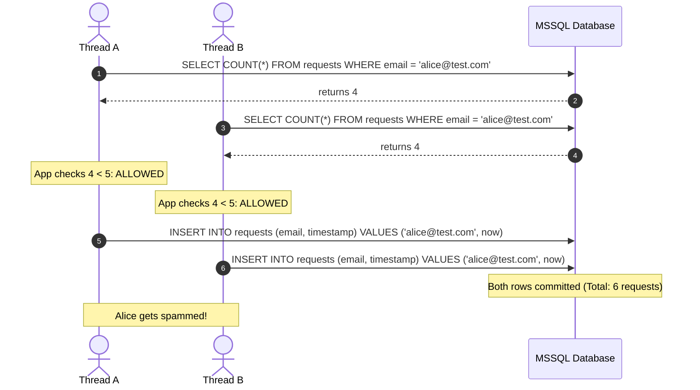
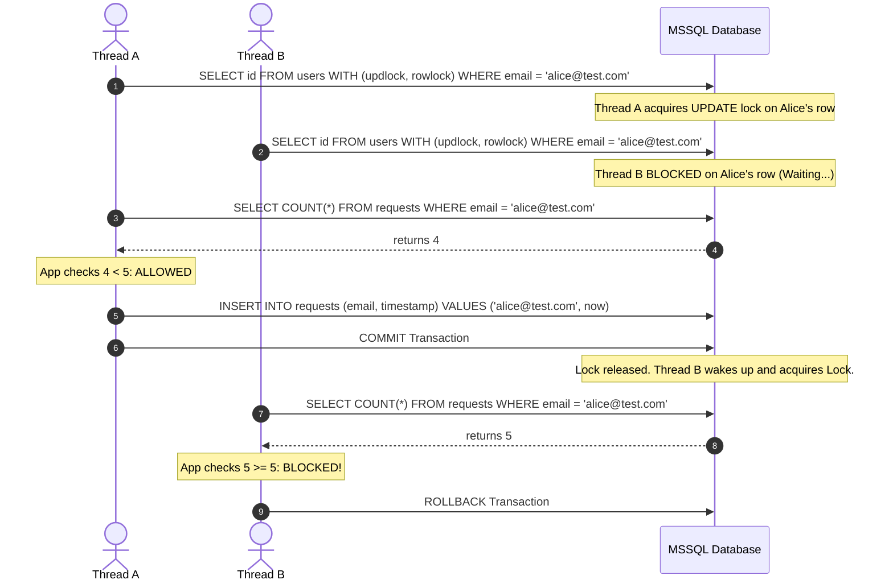

# Pessimistic Locking in MS SQL Server with Spring Data JPA

In a pure database-backed rate limiter, **Pessimistic Locking** is the best defense against concurrent request race conditions. 

By locking the `users` table row for a specific email, you guarantee that only **one thread** can evaluate and write to the database at a time for that specific user.

---

## 1. Concurrency Flow Comparison

### ❌ The Race Condition (Without Locking)

If multiple requests for the same email hit your application concurrently, parallel threads will read the same history count before any writes are committed, allowing limits to be bypassed.



### ✔️ The Serialized Flow (With Pessimistic Lock on User Row)

Because the 5th request row does not exist yet, we lock the existing `User` record to act as a **Lock Anchor**. This serializes all operations *specifically* for that user.



---

## 2. Spring Data JPA Implementation (MSSQL-Specific)

### UserRepository.java

In Spring Data JPA, annotate the fetch query with `@Lock(LockModeType.PESSIMISTIC_WRITE)`. 

```java
package com.example.ratelimiter.repository;

import com.example.ratelimiter.entity.User;
import jakarta.persistence.LockModeType;
import jakarta.persistence.QueryHint;
import org.springframework.data.jpa.repository.JpaRepository;
import org.springframework.data.jpa.repository.Lock;
import org.springframework.data.jpa.repository.Query;
import org.springframework.data.jpa.repository.QueryHints;
import org.springframework.data.repository.query.Param;
import org.springframework.stereotype.Repository;

import java.util.Optional;

@Repository
public interface UserRepository extends JpaRepository<User, Long> {

    /**
     * Finds a user by email and locks their database row immediately.
     * Hibernate automatically translates PESSIMISTIC_WRITE into MSSQL table hints.
     */
    @Lock(LockModeType.PESSIMISTIC_WRITE)
    @Query("SELECT u FROM User u WHERE u.email = :email")
    Optional<User> findByEmailForUpdate(@Param("email") String email);

    /**
     * RECOMMENDED FOR PRODUCTION: Set a lock timeout (in milliseconds)
     * to prevent threads from waiting indefinitely.
     */
    @Lock(LockModeType.PESSIMISTIC_WRITE)
    @QueryHints({
        @QueryHint(name = "jakarta.persistence.lock.timeout", value = "3000") // 3 seconds timeout
    })
    @Query("SELECT u FROM User u WHERE u.email = :email")
    Optional<User> findByEmailForUpdateWithTimeout(@Param("email") String email);
}
```

### ForgotPasswordServiceImpl.java

> [!WARNING]
> The calling service method **must** be annotated with `@Transactional`. Database locks are only held for the active transaction lifespan. Without a transaction boundary, the lock is acquired and immediately discarded, defeating the entire rate limit check.

```java
package com.example.ratelimiter.service.impl;

import com.example.ratelimiter.entity.User;
import com.example.ratelimiter.repository.UserRepository;
import com.example.ratelimiter.repository.ForgotPasswordRequestRepository;
import org.springframework.beans.factory.annotation.Autowired;
import org.springframework.dao.PessimisticLockingFailureException;
import org.springframework.stereotype.Service;
import org.springframework.transaction.annotation.Transactional;

import java.time.LocalDateTime;

@Service
public class ForgotPasswordServiceImpl {

    @Autowired
    private UserRepository userRepository;

    @Autowired
    private ForgotPasswordRequestRepository requestRepository;

    @Autowired
    private EmailService emailService;

    @Transactional
    public void executePasswordResetRequest(String email) {
        try {
            // 1. Acquire the exclusive lock on the user's row
            User user = userRepository.findByEmailForUpdateWithTimeout(email)
                    .orElseThrow(() -> new UserNotFoundException("User not found"));

            // 2. Query request history safely (guaranteed single-threaded for this user)
            LocalDateTime twentyFourHoursAgo = LocalDateTime.now().minusDays(1);
            long recentRequests = requestRepository.countByEmailAndCreatedAtAfter(email, twentyFourHoursAgo);

            if (recentRequests >= 5) {
                throw new RateLimitExceededException("Limit exceeded. Max 5 reset attempts per 24 hours.");
            }

            // 3. Save the new request inside the locked transaction
            ForgotPasswordRequest request = new ForgotPasswordRequest(email);
            requestRepository.save(request);

            // 4. Trigger email dispatch
            emailService.sendResetLink(email, request.getToken());

        } catch (PessimisticLockingFailureException e) {
            // Thrown if the thread fails to acquire the lock within 3 seconds
            throw new RateLimitExceededException("Too many concurrent requests. Please wait a moment.");
        }
    }
}
```

---

## 3. How MS SQL Server Handles Locks Under the Hood

Because MS SQL Server does not support ANSI SQL `FOR UPDATE` syntax, Hibernate’s SQL Server Dialect automatically translates `@Lock(LockModeType.PESSIMISTIC_WRITE)` into **T-SQL Table Hints**:

```sql
SELECT id, email, password_hash 
FROM users WITH (updlock, rowlock, holdlock) 
WHERE email = 'alice@test.com';
```

### Table Hint Functions:
*   **`updlock` (Update Lock)**: Acquires an update lock on the matched record instead of a shared read lock. Other transactions attempting to modify the row or acquire another `updlock` must block and wait.
*   **`rowlock` (Row lock)**: Forces the database engine to lock only the specific index row instead of escalating the lock to page or table levels. This isolates the lockout strictly to Alice.
*   **`holdlock`**: Keeps the lock held until the transaction explicitly commits or rolls back.

### Lock Timeout Handling:
Since MSSQL does not support inline timeout queries (e.g. `WAIT 3`), Hibernate manages lock timeouts dynamically depending on the specified value:

*   **If Timeout = 0 (Immediate Fail)**:
    ```java
    @QueryHints({@QueryHint(name = "jakarta.persistence.lock.timeout", value = "0")})
    ```
    Hibernate appends the native **`NOWAIT`** table hint:
    ```sql
    SELECT ... FROM users WITH (updlock, rowlock, nowait) WHERE email = ?;
    ```
*   **If Timeout > 0 (e.g., 3 seconds)**:
    ```java
    @QueryHints({@QueryHint(name = "jakarta.persistence.lock.timeout", value = "3000")})
    ```
    Hibernate executes a session parameter configuration command immediately preceding the query:
    ```sql
    SET LOCK_TIMEOUT 3000;
    SELECT ... FROM users WITH (updlock, rowlock) WHERE email = ?;
    ```
    *(Hibernate resets the lock timeout back to default once the session completes).*

---

## 4. Operational & Performance Impact

### What happens when other queries try to access this User row?

| Request Type | Behavior | Explanation |
| :--- | :--- | :--- |
| **Standard Select** | **No Blocking** (if RCSI is active) | If your database has **Read Committed Snapshot Isolation (RCSI)** enabled (recommended), ordinary reads will read the last committed snapshot instantly. |
| **Standard Select** | **Blocks** (if RCSI is disabled) | If RCSI is off, standard read queries will block and wait for the transaction to complete, which degrades read throughput. |
| **Write/Updates** | **Blocks** | Queries attempting to `UPDATE` or `DELETE` the user row must wait until the forgot-password transaction commits. |

### 🔍 How to Check and Enable RCSI in SQL Server

Because of the blocking behavior when RCSI is disabled, it is highly recommended to ensure RCSI is active in your production database.

#### 1. Check if RCSI is Enabled
Run this SQL query against your SQL Server instance to check the current configuration status of your database:
```sql
SELECT name, is_read_committed_snapshot_on 
FROM sys.databases 
WHERE name = 'YourDatabaseName';
```
*   If `is_read_committed_snapshot_on` is **`1`**, RCSI is **Active** (Ordinary SELECT reads will never block on locked rows).
*   If `is_read_committed_snapshot_on` is **`0`**, RCSI is **Disabled** (Ordinary reads will block on locked rows).

#### 2. How to Enable RCSI
Enabling RCSI requires altering the database configuration. Since SQL Server requires exclusive access to the database to toggle this setting, use the `SINGLE_USER` rollback command to safely disconnect active sessions during the update:
```sql
-- 1. Force disconnect active connections and enter single-user mode
ALTER DATABASE YourDatabaseName 
SET SINGLE_USER 
WITH ROLLBACK IMMEDIATE;

-- 2. Turn on Read Committed Snapshot Isolation
ALTER DATABASE YourDatabaseName 
SET READ_COMMITTED_SNAPSHOT ON;

-- 3. Restore database back to multi-user mode
ALTER DATABASE YourDatabaseName 
SET MULTI_USER;
```

### Deadlocks & Cooldown:
Because the lock is held for only two fast database operations (checking count and writing a row), the entire transaction commits in **5 to 20 milliseconds**. The impact on profile updates or active logins is virtually imperceptible to the user.
