# System Design: Distributed Rate Limiting Strategies

This document provides a comprehensive overview of rate limiting strategies for authentication endpoints (such as the *Forgot Password* feature). It compares traditional database-backed solutions against high-performance, distributed cache approaches, including **Redis Sliding Window** and the **Token Bucket (Bucket4j)** algorithm.

---

## 1. Traditional Database-Backed Rate Limiting

### The Concept
When a user requests a password reset, the application queries the persistent audit table (e.g., `forgot_password_requests`) to count how many requests were made within the last 24 hours.

```sql
SELECT COUNT(*) 
FROM forgot_password_requests 
WHERE email = :email 
  AND created_at >= NOW() - INTERVAL 1 DAY;
```

If the count is less than 5, a new row is written to generate a verification token, and the email is sent. If it is 5 or more, the request is rejected.

### Pros & Cons

| Pros | Cons |
| :--- | :--- |
| **Simplicity**: No additional infrastructure is needed (uses your existing MySQL/Postgres database). | **Database Bottleneck**: Under a brute-force or spam attack, executing high-volume queries with aggregate functions (`COUNT`) will strain DB resources, deplete connections, and risk a Denial of Service (DoS). |
| **Audit Compliance**: Naturally records a secure, permanent audit log of reset requests. | **Distributed Race Conditions**: Under high concurrency (e.g., double-clicks), two threads can read the same count simultaneously, resulting in limits being bypassed. |
| **Crash Durability**: Since it is written to disk, rate limit states survive server restarts. | **No IP-Based Protection**: Attackers spamming thousands of different email addresses bypass this per-user check entirely, ruining email domain reputation. |

---

## 2. Redis Sliding Window (ZSET)

### The Concept
A **Sliding Window** continuously evaluates limits relative to the exact millisecond a request is made, rather than resetting at a fixed calendar block (like midnight). 

Using Redis, this is implemented using a **Sorted Set (ZSET)**.
* **Key**: `rate_limit:forgot_password:email:<email>`
* **Member**: A unique request identifier (Unix timestamp + random UUID).
* **Score**: The Unix epoch timestamp (in milliseconds).

```mermaid
gantt
    title 24-Hour Sliding Window Log (ZSET)
    dateFormat  X
    axisFormat %s
    section ZSET Timeline
    Expired Requests (Removed) :active, 0, 1716497875000
    Active Window (Max 5)      :crit, 1716497875000, 1716584275000
    Current Request (Now)     :milestone, active, 1716584275000, 0d
```



### Redis Command Flow
For each incoming request at timestamp `1716584275000` (Now):

1. **Evict Expired Entries**: Remove all entries older than 24 hours (`now - 86,400,000` ms).
   ```redis
   ZREMRANGEBYSCORE rate_limit:forgot_password:email:user@example.com -inf 1716497875000
   ```
2. **Retrieve Current Count**:
   ```redis
   ZCARD rate_limit:forgot_password:email:user@example.com
   ```
3. **Condition Check**:
   * If `ZCARD < 5`: Add the new request, set key TTL to 24 hours, and allow the request.
     ```redis
     ZADD rate_limit:forgot_password:email:user@example.com 1716584275000 1716584275000
     EXPIRE rate_limit:forgot_password:email:user@example.com 86400
     ```
   * If `ZCARD >= 5`: Reject with `HTTP 429 Too Many Requests`.

> [!IMPORTANT]
> To prevent race conditions in distributed systems, these commands must be executed atomically using a **Redis Lua Script** or a **Redis transaction (MULTI/EXEC)**.

---

## 3. Token Bucket & Bucket4j

### The Token Bucket Algorithm
The **Token Bucket** algorithm uses the metaphor of a bucket with a set capacity that holds tokens. 
* The bucket has a **Maximum Capacity** (e.g., 5 tokens).
* Each request **consumes exactly 1 token**.
* Tokens are **continuously replenished** at a fixed rate (e.g., 1 token every 4.8 hours).

```
       [ Continuous Refill: 1 token / 4.8 hrs ]
                         │
                         ▼
                ┌─────────────────┐
                │ 🪙  🪙  🪙      │  <-- Capacity: 5 Tokens
                └─────────────────┘
                         │
                 [ Request Consumes ]
                         │
                         ▼
                [ Allow Reset Email ]
```

### Mathematical Optimization
Unlike the Sliding Window which stores *every request timestamp*, the Token Bucket algorithm only needs to store a tiny key-value payload representing the **current token balance** and the **last consumption timestamp**. 

When a request arrives, it performs a simple, high-speed mathematical check:
$$\text{Tokens Available} = \min\left(\text{Capacity}, \text{Current Tokens} + \frac{\text{Time Elapsed since last update}}{\text{Refill Interval}}\right)$$

### Leveraging Bucket4j with Redis (Java/Spring Boot)
In distributed systems, the bucket state is synced using a `ProxyManager` backed by a Redis library (like Lettuce or Redisson).

#### 1. Configuration Setup
```java
@Configuration
public class RateLimitConfig {

    @Bean
    public ProxyManager<String> proxyManager(RedisClient redisClient) {
        StatefulRedisConnection<String, byte[]> connection = redisClient.connect(
                RedisCodec.of(StringCodec.UTF8, ByteArrayCodec.INSTANCE)
        );
        return LettuceBasedProxyManager.builderFor(connection)
                .withExpirationStrategy(
                        ExpirationAfterWriteStrategy.basedOnTimeForRefillingBucketUpToMax(
                                Duration.ofDays(1)
                        )
                )
                .build();
    }
}
```

#### 2. Service Implementation
```java
@Service
public class RateLimiterService {

    @Autowired
    private ProxyManager<String> proxyManager;

    // Define 5 tokens per 24 hours (1 token every 4.8 hours)
    private final Supplier<BucketConfiguration> forgotPasswordConfig = () -> BucketConfiguration.builder()
            .addLimit(limit -> limit.capacity(5).refillGreedy(1, Duration.ofHours(24 / 5))) 
            .build();

    public boolean tryConsumeForgotPassword(String email) {
        String redisKey = "rate_limit:forgot_password:" + email;
        Bucket bucket = proxyManager.builder().build(redisKey, forgotPasswordConfig);
        return bucket.tryConsume(1);
    }
}
```

---

## 4. Implementing Dynamic Capacity Changes

As application requirements scale, you may need to increase the limit (e.g., from 5 to 10 requests).

### Option A: Static Deployment Update
If you change the limit in code and redeploy:
* **Sliding Window**: Easy. Just change the comparison integer in the application (`if count >= 10`). Existing Redis records will automatically align.
* **Token Bucket (Bucket4j)**: Since configurations are serialized inside Redis, changing the limits in your Java code can cause structure conflicts. 
  * *Best Practice*: Clear your rate-limiting keys during deployment:
    ```bash
    redis-cli --eval "for _,k in ipairs(redis.call('keys','rate_limit:forgot_password:*')) do redis.call('del',k) end" 0
    ```

### Option B: Runtime Dynamic Configuration
If you need to change limits on the fly (without redeploying or clearing existing buckets), Bucket4j natively supports the `replaceConfiguration` API.

When replacing limits, you must select a **Token Inheritance Strategy** to manage remaining tokens:
1. `AS_IS`: Keeps the exact number of remaining tokens.
2. `RESET`: Instantly refills the bucket to the new max capacity.
3. `PROPORTIONALLY` (Recommended): Scales tokens proportionally (e.g., if a user has 2 out of 5 tokens left [40%], they will have 4 out of 10 tokens left under the new configuration).

```java
public void updateLimitDynamically(String email, int newCapacity) {
    String redisKey = "rate_limit:forgot_password:" + email;
    
    BucketConfiguration newConfig = BucketConfiguration.builder()
            .addLimit(limit -> limit.capacity(newCapacity).refillGreedy(1, Duration.ofHours(24.0 / newCapacity)))
            .build();

    Bucket bucket = proxyManager.builder().build(redisKey, forgotPasswordConfig);
    
    // Atomically swap the configuration in Redis
    bucket.replaceConfiguration(newConfig, TokensInheritanceStrategy.PROPORTIONALLY);
}
```

---

## 5. Architectural Comparison Matrix

| Architectural Dimension | Database Queries | Redis Sliding Window | Bucket4j / Token Bucket |
| :--- | :--- | :--- | :--- |
| **Redis Memory Usage** | N/A (Stored in DB) | High (Stores every timestamp) | **Very Low** (Stores only 2 variables) |
| **DB Load** | High (Aggregations & writes) | None | None |
| **Concurrency Safety** | Complex (Requires locks) | Native (Using Lua Script) | **Native** (Built-in via ProxyManager) |
| **Implementation Complexity** | Low | Medium | Low to Medium |
| **Dynamic Configuration** | Very High (Change in DB) | Very High (Change threshold) | High (Requires configuration swap) |

---

## 6. Hardened Database-Backed Rate Limiting (Under Constraints)

If a traditional database is your **only** choice (e.g., no Redis/Memcached cluster is available), you must adopt specific architectural patterns to mitigate **Concurrency (Race Conditions)** and **Database DoS (Overload)**.

### A. Mitigating Concurrency (Race Conditions)

If multiple requests for the same email hit your servers concurrently, parallel threads will read the same low count, approve the requests, and spam emails.

#### 1. Pessimistic Locking on the User Record (Recommended)
You cannot easily lock a non-existent row in a `forgot_password_requests` table. Instead, **lock the corresponding record in the `users` table** at the start of your transaction. This serializes all reset requests for that specific user.

```java
@Transactional
public void processPasswordReset(String email) {
    // 1. Acquire an exclusive lock on the user's account row.
    // Equivalent to SQL: SELECT id FROM users WHERE email = :email FOR UPDATE;
    User user = userRepository.findByEmailForUpdate(email)
            .orElseThrow(() -> new UserNotFoundException());

    // 2. Perform the count query (safely serialized).
    long count = requestRepository.countByEmailWithin24Hours(email);
    if (count >= 5) {
        throw new RateLimitExceededException();
    }

    // 3. Insert new request and trigger email.
    requestRepository.save(new ForgotPasswordRequest(email));
}
```

#### 2. Debouncing via Unique Index Constraints
If you want to prevent rapid repeated clicks (e.g. at most 1 request per minute), create a unique index combined with a calculated timestamp key. For example, store a dynamic unique key in a column: `unique_window_key` as `email:date:minute` (e.g., `user@test.com:2026-05-24:22:15`). 
* If two threads insert a row in the same minute, the DB will throw a `DuplicateKeyException` at the database index layer, instantly stopping the concurrent execution.

---

### B. Mitigating Database DoS & Overload

A bot spamming your forgot password API can flood your application, forcing it to execute hundreds of database reads and writes per second, crashing the DB.

#### 1. First Line of Defense: Local In-Memory Caching (JVM Level)
Even without a distributed Redis cluster, you should check a fast **local in-memory cache** in the application JVM before querying the database.
* **Caffeine Cache** is the standard for high-performance JVM caching.
* When a request comes in:
  1. Check the local Caffeine cache. If the cache marks the email as "blocked", fail fast (return `HTTP 429`) **without hitting the database**.
  2. If the cache is empty, query the database, update the cache, and proceed.
  This shields your database from 99% of spam hits.

```java
// Setup local Caffeine cache with a 24-hour expiration policy
Cache<String, Integer> localRateLimitCache = Caffeine.newBuilder()
        .expireAfterWrite(24, TimeUnit.HOURS)
        .maximumSize(50_000) // Caps memory footprint
        .build();
```

#### 2. Local Token Buckets using In-Memory Bucket4j
You can run Bucket4j **in-memory** on your local application node without Redis! While this doesn't share state across multiple servers, it is perfect for blocking high-speed localized bot attacks.
* Configure an in-memory Bucket per IP address or email using a simple concurrent map cache in Java. This blocks spam within microseconds at the application layer.

#### 3. Intercepting Bots (WAF and CAPTCHAs)
The absolute best defense against DB DoS is ensuring the request **never reaches your application server**:
* **Frontend CAPTCHA (Cloudflare Turnstile, reCAPTCHA v3)**: Intercept submissions on the form. The controller verifies the CAPTCHA token first. A bot failing the CAPTCHA will be rejected before a database connection is even checked out.
*   **IP Rate Limiting on API Gateway**: Enforce a strict rate limit per IP at the Nginx, Cloudflare, or AWS API Gateway level (e.g., max 10 auth requests per minute per IP).

---

## 7. Security Analysis: Storing Non-Existent Emails & Storage Exhaustion Attacks

To protect your system from **Email Enumeration (Privacy Leakage)**, a common best practice is to treat existent and non-existent emails identically on the surface. If you write forgot-password audit records for *every* request, you neutralize timing attacks.

However, this creates a major vulnerability: **Database Storage Exhaustion (Disk Fill DoS)**.

### The Threat Vector
An attacker scripts a bot to submit requests for millions of randomized, non-existent email addresses (`dummy1@fake.com`, `dummy2@fake.com`, etc.).
*   **Result**: 
    1. Your primary SQL database table (`forgot_password_requests`) balloons by millions of rows in hours.
    2. Your database disk storage is depleted, causing system-wide failures.
    3. Index memory is exhausted, degrading query performance for all active users.
    4. Your audit database is polluted with junk data, ruining business reporting.

---

### Mitigations & Defense-in-Depth

#### 1. In-Memory Cache (Redis/Caffeine) as the Gatekeeper for Non-Existent Emails
Do not write non-existent emails to your primary SQL table. Instead, leverage your memory cache (Redis or local Caffeine cache) to absorb these hits.

```
Incoming Request for "dummy@fake.com"
  │
  ├──► 1. Check if email exists in DB (Fast index lookup)
  │
  ├──► [Exists]
  │      └──► Write audit row to SQL DB
  │      └──► Send reset link email
  │
  └──► [Does NOT Exist]
         └──► Log rate limit event *only* in Redis/Caffeine cache (with strict 24h TTL)
         └──► Introduce a mock delay (to match timing footprint of DB write + SMTP call)
         └──► Return generic success response
```
*Why this works*: You completely shield your SQL database from junk writes. Redis handles millions of transient keys easily and automatically evicts them after 24 hours, ensuring your storage footprint has a strict mathematical limit.

#### 2. Strict Partitioning & Auto-Purging (TTL)
If writing to the SQL database is your only architecture option, you **must** implement a strict background auto-purge cleanup routine.
* Since a password reset token is only valid for 15-30 minutes, you do not need to keep historical requests forever.
* Set up a database **Cron Job** (e.g., SQL Server Agent Job or Spring `@Scheduled` task) that runs every hour and aggressively deletes request logs older than 24 hours:
  ```sql
  DELETE FROM forgot_password_requests 
  WHERE created_at < DATEADD(day, -1, GETDATE());
  ```
* This guarantees that your database table has a natural upper bound on storage size, regardless of how many dummy emails are spammed.

#### 3. Intercepting the Bot at the Gateway (Network Level)
Never rely entirely on your application code to handle high-volume attacks. Block them before they reach your server:
* **CAPTCHAs (Cloudflare Turnstile)**: Enforcing a CAPTCHA verification on your forgot-password form completely halts automated email-generator bots.
* **IP Rate Limiting**: Limit the number of password reset requests a single IP address can make (e.g., max 5 per hour). This stops an attacker from sitting on one machine and sending requests for thousands of different dummy emails.

---

## 8. Aligning Time Footprints (Mitigating Timing Attacks)

To prevent statistical timing analysis from revealing whether an email is registered, you must align the API response latency. There are two main ways to achieve this in a Spring Boot environment:

### Method 1: The Asynchronous Gold Standard (Highly Recommended)
Instead of slowing down your fake requests to match the slow speed of a database write and SMTP call, **make the real request return instantly** by offloading the expensive work asynchronously.

```
Incoming Reset Request 
  │
  ├──► 1. Rate Limit Check (2ms)
  ├──► 2. Check if User Exists in DB (5ms)
  │
  ├──► [Exists]
  │      └──► Publish "ForgotPasswordEvent" to internal application memory
  │      └──► Return Generic Success Response IMMEDIATELY (~7ms total)
  │
  └──► [Does NOT Exist]
         └──► Return Generic Success Response IMMEDIATELY (~7ms total)

---------------------------------------------------------------------------------
[Background Thread Pool (Asynchronous Execution - 100% Invisible to User API)]
  └──► Listener catches ForgotPasswordEvent
  └──► Lock user, check history, write token, and dispatch SMTP mail (250ms)
```

#### Why it's the absolute best practice:
* **Zero Timing Footprint**: The API response time is identical (~7ms) for both real and fake emails, completely neutralizing timing attacks.
* **Peak Performance**: Your API endpoint returns immediately, releasing server threads to handle other traffic instead of waiting for a sluggish email server connection.

#### Spring Boot `@Async` Implementation:
1. Enable Async in your application:
   ```java
   @Configuration
   @EnableAsync
   public class AsyncConfig {}
   ```
2. Offload the SMTP and DB token generation to a separate service method:
   ```java
   @Service
   public class MailService {
       @Async
       public void sendPasswordResetAsync(String email) {
           // Expensive DB transaction, token generation, and SMTP transport happens here!
       }
   }
   ```
3. Call it from your controller:
   ```java
   @PostMapping("/forgot-password")
   public ResponseEntity<String> requestReset(@RequestParam String email) {
       boolean allowed = rateLimiter.tryConsume(email);
       if (!allowed) return ResponseEntity.status(429).body("Too many requests");

       if (userService.exists(email)) {
           // Returns instantly; execution continues in background thread
           mailService.sendPasswordResetAsync(email);
       }
       return ResponseEntity.ok("If registered, instructions have been sent.");
   }
   ```

---

### Method 2: Adaptive/Jittered Delay (Fallback)
If you cannot run async processing due to specific design constraints, you must introduce an adaptive delay that simulates the time footprint of a database write and SMTP dispatch, injected with **random noise (jitter)** to defeat statistical averages.

```java
@PostMapping("/forgot-password")
public ResponseEntity<String> requestReset(@RequestParam String email) throws InterruptedException {
    long startTime = System.currentTimeMillis();

    boolean exists = userService.exists(email);
    if (exists) {
        // Real process: DB write + SMTP call (Takes e.g. 230ms)
        userService.saveRequestAndSendEmail(email);
    } else {
        // Fake process: Align time footprint with a jittered delay
        long executionTime = System.currentTimeMillis() - startTime;
        
        // Define average target SMTP latency (e.g. 250ms) + random jitter (+/- 50ms)
        long targetLatency = 250 + ThreadLocalRandom.current().nextLong(-50, 50);
        long remainingDelay = targetLatency - executionTime;

        if (remainingDelay > 0) {
            Thread.sleep(remainingDelay); // Pause the thread to match footprint
        }
    }
    return ResponseEntity.ok("If registered, instructions have been sent.");
}
```
*Why jitter is necessary*: Standard timing analysis tools send hundreds of requests and calculate statistical averages. A fixed sleep (like `Thread.sleep(250)`) still leaves a distinct, uniform distribution that computers can differentiate from the variable latencies of actual network TCP handshakes. Adding dynamic jitter makes statistical matching highly unreliable.

